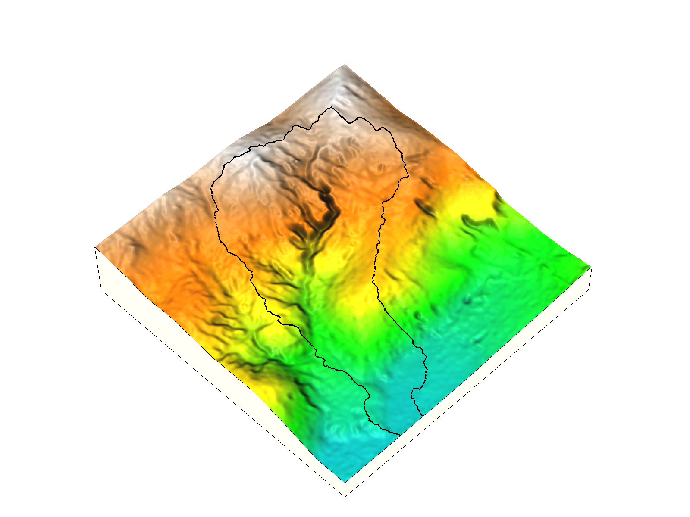
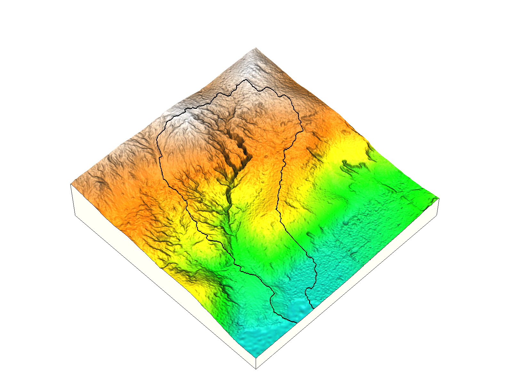
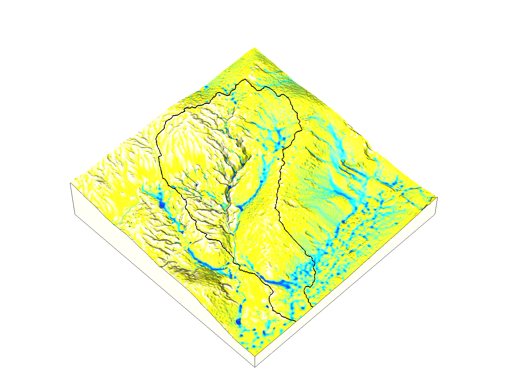
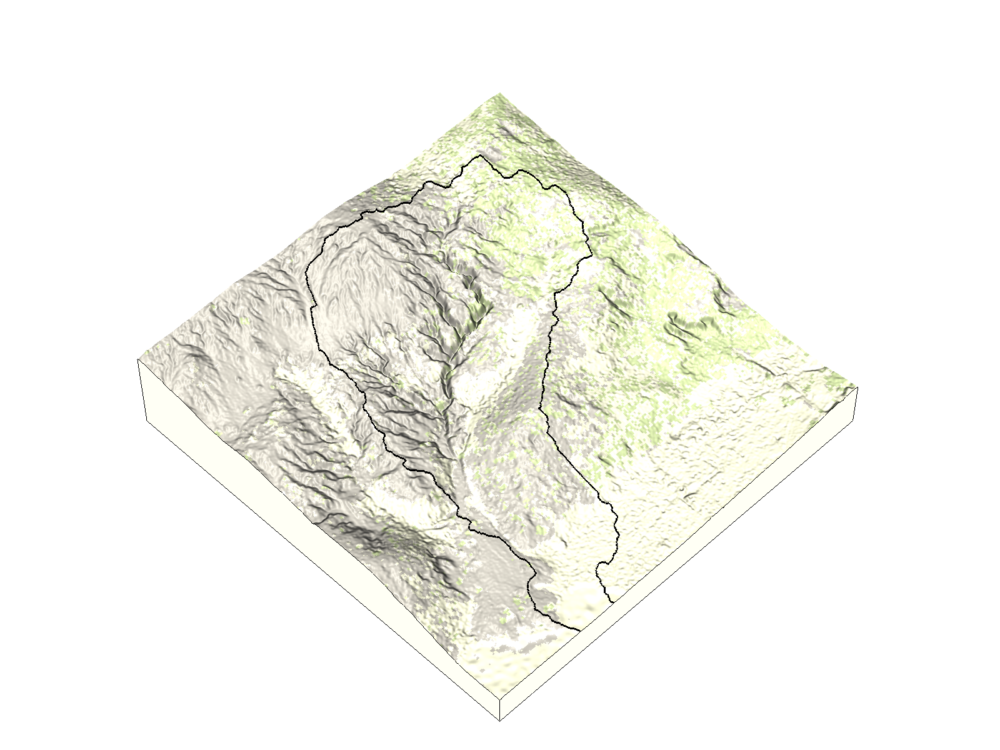
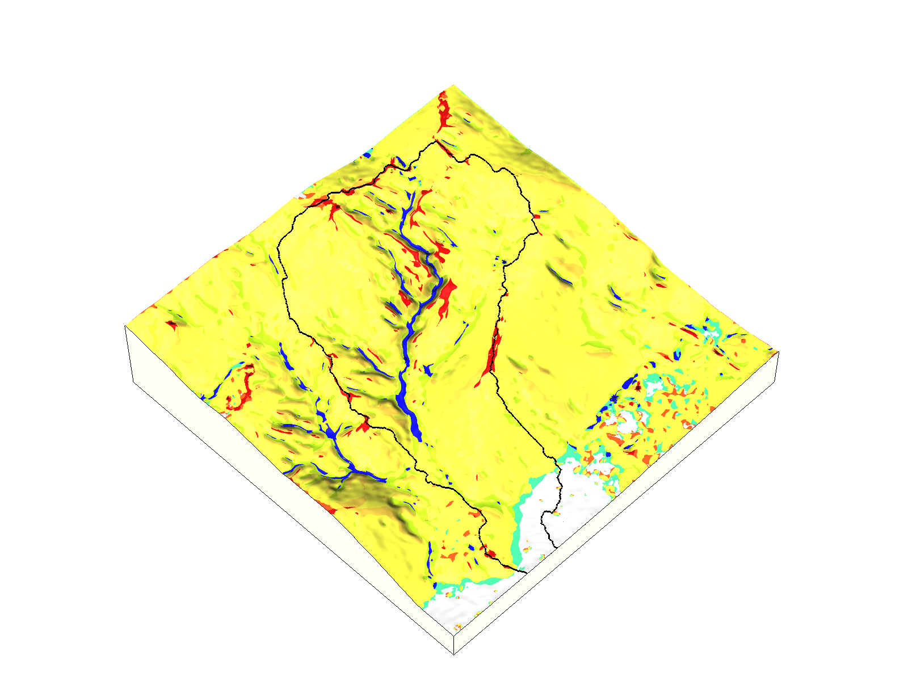
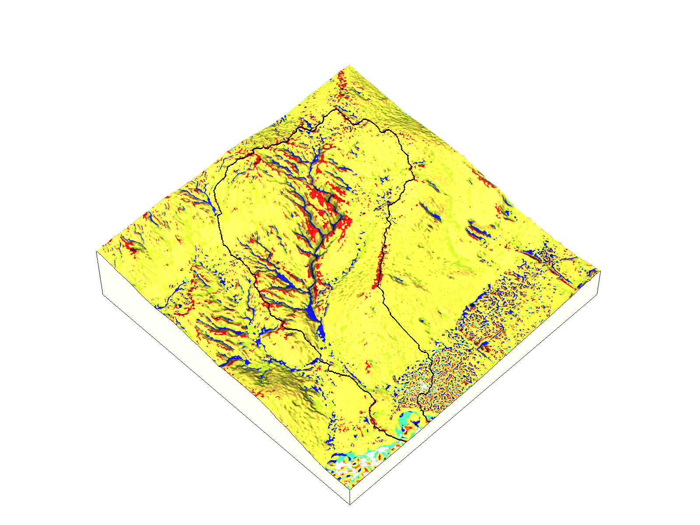

# Landscape evolution dataset
A sample dataset for the
[r.evolution](https://github.com/baharmon/landscape_evolution)
landscape evolution model.
This dataset includes
the [GRASS GIS](grass.osgeo.org) location **nc_spm_evolution**.
This location is in the North Carolina State Plane HARN Meters
coordinate system (EPSG code 3358).
It contains the mapset **PERMANENT**
with spatial data for Fort Bragg, NC.
The location also contains
rainfall records,
rules for custom color tables,
rules for recoding data,
and metadata.

The mapset includes:
1. a 10-meter resolution digital elevation model for 2012 for Fort Bragg
2. a time series of 1-meter resolution digital elevation models for 2004, 2014, and 2016
for near a highly eroded watershed near Patterson Branch Creek on Fort Bragg
3. 1-meter resolution orthoimagery for 2006, 2009, 2010, 2012, and 2014 for the watershed
4. derived data including shaded relief, landforms, and landcover

Elevation 2004 | Elevation 2016
:-------------------------:|:-------------------------:
 | 

Depth 2016 | Difference 2004-2016
:-------------------------:|:-------------------------:
 | 

Imagery 2014 | Landcover 2014
:-------------------------:|:-------------------------:
 | 

Landforms 2004 | Landforms 2016
:-------------------------:|:-------------------------:
 | 

## Credits
This sample dataset is derived from publicly available data from
the US Army, USGS, USDA, NC Floodplain
Mapping Program, and the NC State Climate Office.

USDA NAIP was acquired from the
[USGS Earth Explorer](https://earthexplorer.usgs.gov/).

Soil data was acquired from the
[USDA Soil Survey](http://websoilsurvey.sc.egov.usda.gov/).

2001 lidar data collected by the NC Floodplain Mapping Program
was acquired from the NC Floodplain Mapping Program's
Spatial Data Download site and the USGS Earth Explorer.

2012 lidar data was acquired by contacting Fort Bragg.

2015 lidar data was acquired from NC Floodplain Mapping Program's
[Spatial Data Download site](https://rmp.nc.gov/sdd/).

Weather data was acquired from the State Climate Office of North Carolina's
[Climate Retrieval and Observations Network Of the Southeast](http://climate.ncsu.edu/cronos)

## License
This dataset is licensed under the
[Open Database License](https://opendatacommons.org/licenses/odbl/)
by Brendan Harmon
